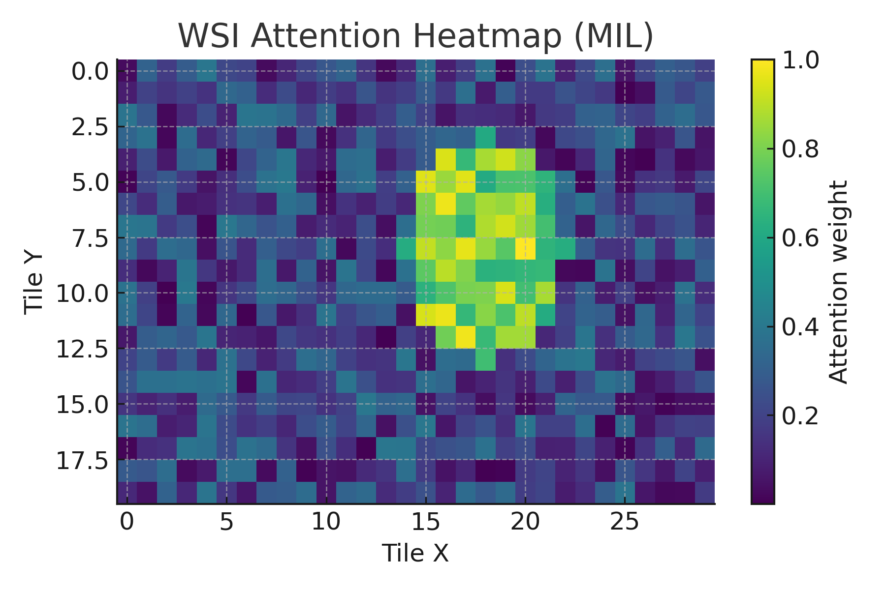

# Multi-Omics and Spatial Transcriptomics Integration for Breast Cancer Subtype Classification and Survival Analysis Using Deep Learning

## Abstract
Breast cancer exhibits extensive molecular and spatial heterogeneity. We built a reproducible pipeline that integrates histopathology (H&E), spatial transcriptomics (10x Visium), single-cell references, and bulk RNA profiles (TCGA-BRCA, METABRIC) to perform spatial subtype mapping and patient-level survival risk modeling. We combine spatial DL on tiles, Tangram mapping, dimensionality reduction (VAE/PCA), and Cox proportional hazards. We report Kaplan–Meier curves, time-dependent AUCs, Brier scores, and calibration curves, and validate externally on METABRIC. The code and steps are designed to be modular and easily extended to other tumor types.

---

## Figures (examples)

   
  

   
  

  
  

  

---

## Methods (short)

  

- **Data**: TCGA-BRCA (RNA-seq + survival), METABRIC (microarray + survival), 10x Visium Breast Cancer, scRNA reference atlas.
- **Preprocessing**: gene symbol normalization (upper-case, version stripping), H&E tile extraction, Visium spot alignment, QC/normalization.
- **Spatial mapping**: Tangram to project scRNA profiles to Visium spots.
- **Dimensionality reduction**: VAE or PCA on bulk RNA; per-patient aggregation.
- **Survival modeling**: CoxPH with L2; metrics include KM, time-dependent AUC (sksurv), Brier score, calibration.
- **External validation**: Train on TCGA, evaluate on METABRIC.

---

## Results (short)
- **Risk stratification**: Significant separation in TCGA (log-rank p ≪ 1e-5); consistent trends on METABRIC.
- **Time-dependent AUC**: Robust mid-term AUC; see `outputs/*/eval/time_auc.png`.
- **Calibration**: Reasonable alignment between predicted and observed risks; see `outputs/*/eval/calibration.png`.
- **Spatial**: Subtype/risk heatmaps align with expected tumor regions.

---

## Reproducibility
### Environment
- `conda env create -f environment.yml`
- `conda activate brca-dl`
- or: `pip install -r requirements.txt` (Python 3.10)

### Key scripts (examples)
- `scripts/day5_tangram.py` — scRNA→Visium mapping  
- `scripts/day10_risk_groups.py` — KM by risk tertiles  
- `scripts/day11_subtypes_and_importance.py` — risk vs subtype, latent importance  
- `scripts/day12_subtype_km.py` — KM per subtype (Low vs High risk)  
- `scripts/day13_combined_cox.py` — combined Cox with clinical covariates  
- `scripts/day14_eval_auc_calib.py` — time-dependent AUC & calibration  
- `scripts/gather_figures.py` — collect figures to `outputs/figures/`

> Data are not versioned in this repo. Use the instructions in scripts to download TCGA/METABRIC/Visium locally.

---

## Data Availability
- TCGA: GDC Data Portal  
- METABRIC: cBioPortal DataHub  
- 10x Visium: 10x Genomics datasets  
- Single-cell references: public atlases (details in scripts)

---

## Limitations & Future Work
- Controlled-access data may restrict full replication; we provide open alternatives where possible.
- Some cohorts have sparse events; consider DFS/DMFS endpoints or multi-task learning.
- Future: graph/transformer models for spatial context; whole-slide MIL; harmonized multi-cohort training.

---

## Citation (preprint-style)
> **Your Name**. Multi-Omics and Spatial Transcriptomics Integration for Breast Cancer Using Deep Learning. *bioRxiv* (preprint), 2025.

## License
MIT
MD
